Java versus Kotlin

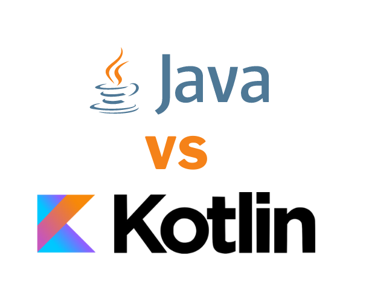

By: Ricky van Rijn & Thom van Kalkeren

---

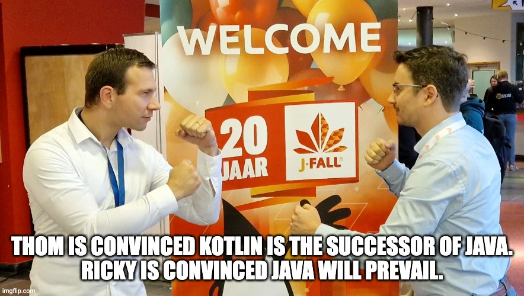

---

Who

---

Thom

Kotlin Enjoyer / Software Architect


<div>
    <div style="display: flex; justify-content: center; align-items: center;">
        
        
        : @rescribet
    </div>
</div>

Note:
Actually not from the Java world, coming to the JVM ecosystem from Ruby and TypeScript, also not a Guru, that's just what Ricky calls me. 

Programming for X years. 10+ years of professional experience. Some say I quit the startup world to look after my kids,
others say that I just wanted to work with Kotlin, we'll never know...

---

Ricky

34, Veenendaal, Java Developer


---

# Enough about us..
> Show of hands

Note:
- Who's afraid to put their hand up?
- Who's programmed in Java?
- Who's programmed in Kotlin?
- Who thinks programming is fun?
    Many: Good for you.
    Few: We're gonna change that.

---

Java still runs on 3 billion devices...

[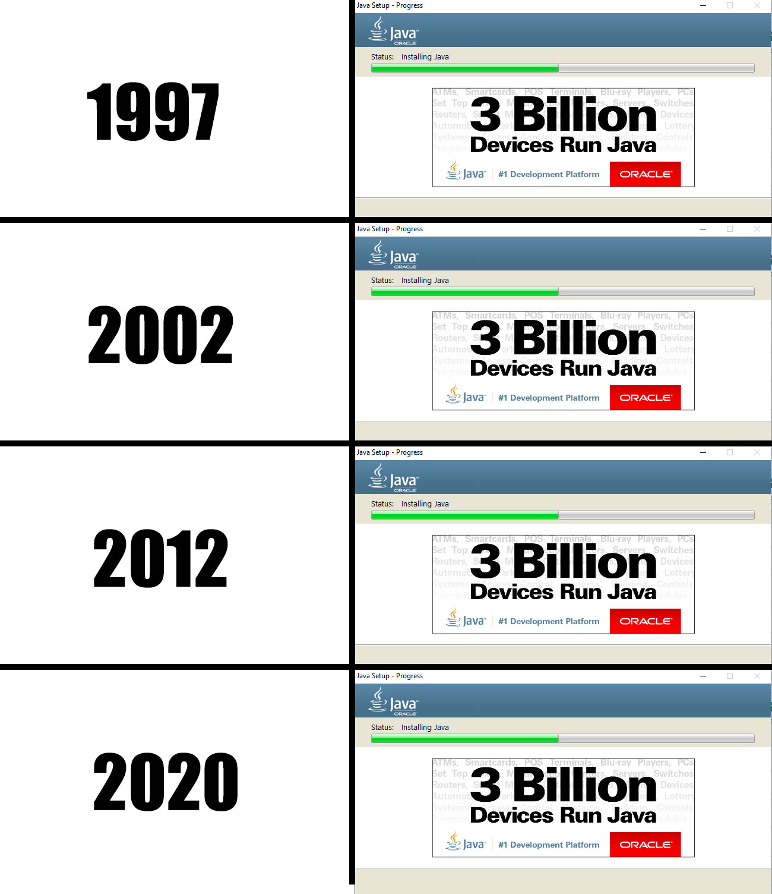](image.png)

---

Kotlin also runs ....

Note:
What's the best metric? Android devices of course.

---

On 3 billion devices


<cite style="font-size: .6em">blog.google/products/android/io22-multideviceworld, May 2022</cite>

---

On 3 billion devices


<cite style="font-size: .6em">(excluding iOS, desktops, and servers)</cite>

Note:
Jetbrains toolbox is also written in Kotlin.

---

# Java 21 - Project Loom 

* Virtual Threads 
* Continuation
* Concurrency paradise

Note: Old concurrency the thread was a wrapper around an OS thread. The loom variant has taken control towards inside the JVM.

---

# Traditional Threads

- OutOfMemoryError within seconds....
- OS Handles the threads directly

---
```java
class MyRunnable implements Runnable{  
    public void run(){  
        System.out.println("thread is running...");  
    }  
  
    public static void main(String args[]){
        MyRunnable myRunnable = new MyRunnable();  
        Thread myThread =new Thread(myRunnable);   // Using the constructor Thread(Runnable r)  
        myThread.start();  
     }  
}  
```
---

# Virtual Threads

- Stored in the heap instead of the stack!
- Smaller memory footprint
- Multiple virtual Threads on a carrier thread (non-blocking IO)

---
``` java
private static Thread virtualThread(String name, Runnable runnable) {
    return Thread.ofVirtual()
    .name(name)
    .start(runnable);
}
```
---
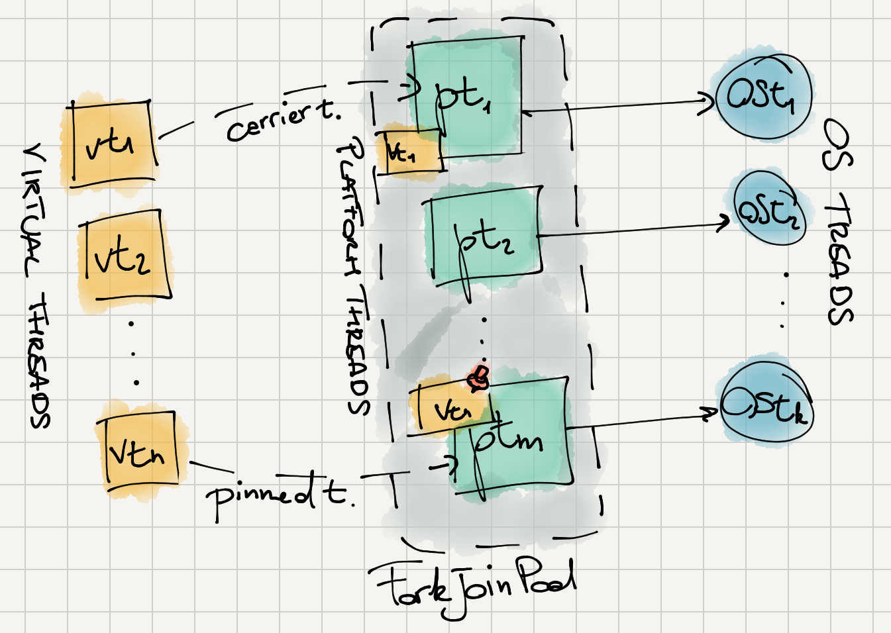
---

# Kotlin Coroutines

Note: Let's play a game, spot the differences

---

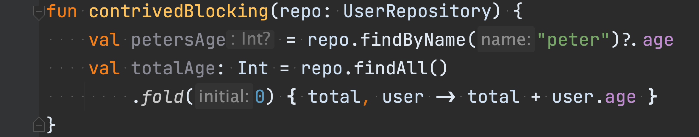

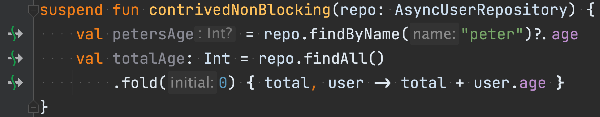

Note:
Technical tidbits: Coroutines use structured concurrency, support cooperative cancellation,
and you can use loom as the dispatcher, or write your own if you love fixing race conditions.


---

One more thing..

---

Works on Java 6

```dockerfile
FROM vulhub/openjdk:6-jre

ADD build/libs/java-6-coroutines-1-all.jar /app.jar

CMD ["java", "-jar", "/app.jar"]
```


```kotlin
suspend fun carInTheStoneAge() {
    println("Hello World!")

    launch { // launch a new coroutine and continue
        delay(1000L) // non-blocking delay for 1 second (default time unit is ms)
        println("World!") // print after delay
    }
    println("Hello") // main coroutine continues while a previous one is delayed
}
```

---

Java is market leader
* Public sector
* Finance
* Industry

---

Kotlin is becoming market leader

* Android SDK is Kotlin by default
* Gradle switched to Kotlin DSL by default
* Spring Framework is getting native support for Kotlin since 3.0

---


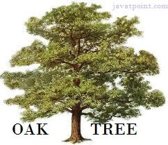


Note: Java is named after the origin of a cup of coffee
* The coffee inspired James with the origin of the coffee
* The Indonesian island called Java
* First name was Oak
* Oak was a name with patent so they needed another name

---

Kotlin is also named after an island

---

## Church of Kotlin


Note:
- A beautiful church
- But no coffee :(

---

Java has a lot of libraries/frameworks to support your solution
* Spring
* Lombok
* Many more on maven repositories such as Maven Central, Google

---

# Kotlin's compiler has your back


---

```kotlin [1-4|7|8-9|10-11]
data class User(
    val name: String,
    val address: Address?,
)

fun contrived() {
    println(user.name)
    // Compilation error
    println(user.address.street)
    // Valid
    println(user.address?.street ?: "unknown")
}
```

Note:
We have a user, but we don't know if it has an address.
Accessing the name is fine
But accessing the street throws a compilation error
Using the safe call operator we can access the street, using the elvis operator we can provide a fallback.

---

Getters/Setters

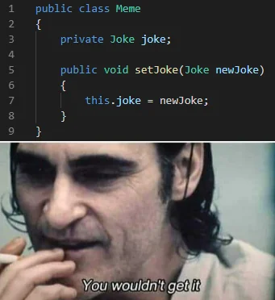

Note:
People won't get angry at you for making your public fields public.

---

Getters/Setters

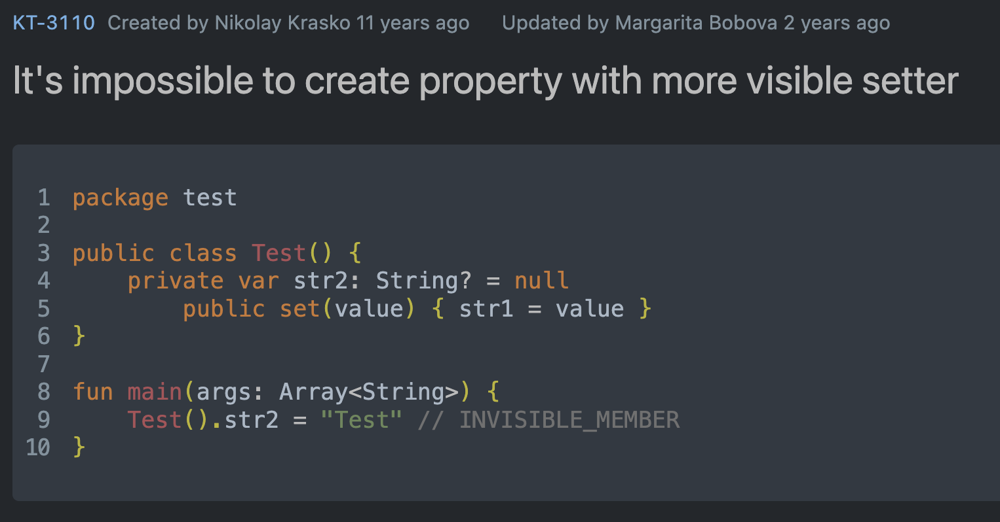

---

Getters/Setters

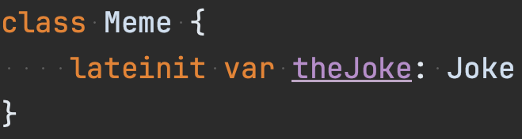

---

(Compose) Multiplatform


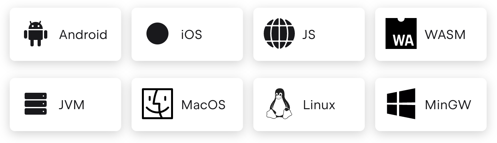

Note: Breaking the order, curious about Ricky's answer

Kotlin has built-in support for other targets
All your common source is in a separate folder
Whenever something specific is needed it's in its own folder

---


---

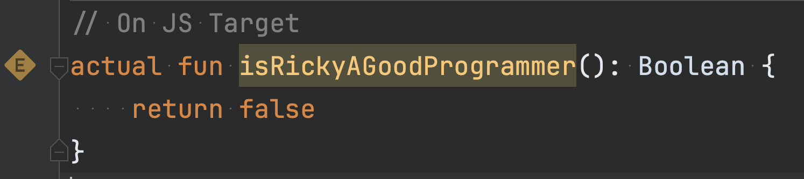

---

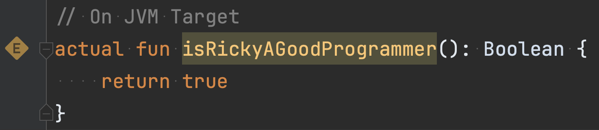

Note: compose makes this even regarding UIs

---

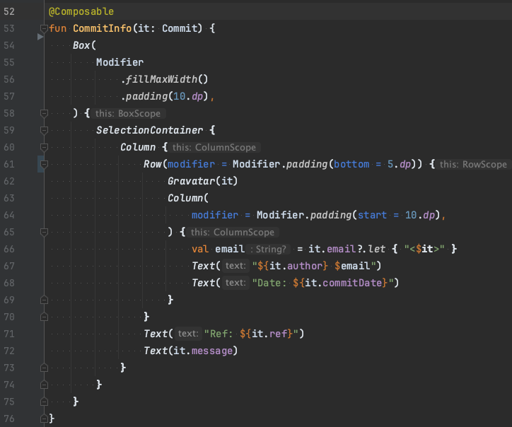


Note:
Built an actual git GUI from scratch in 2 days for OSX, Windows, and Linux.
Actually loved building it, since I had the power of Flutter without having to learn Dart.

And no, I'm not getting paid by JetBrains, but if they want to hire me 🤷🏻‍♂️... (Ricky: interject).

---

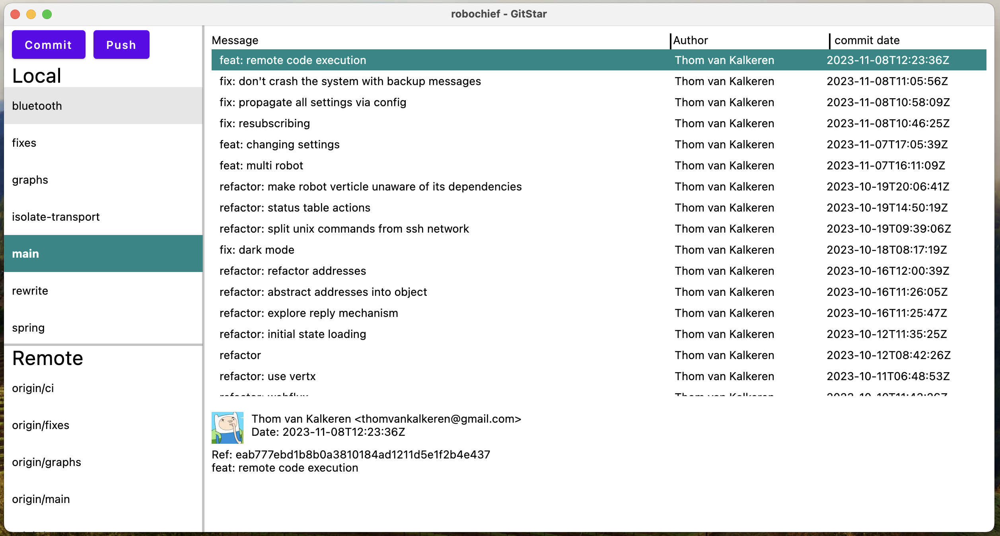

---

# JavaFX


---

# TIOBE INDEX

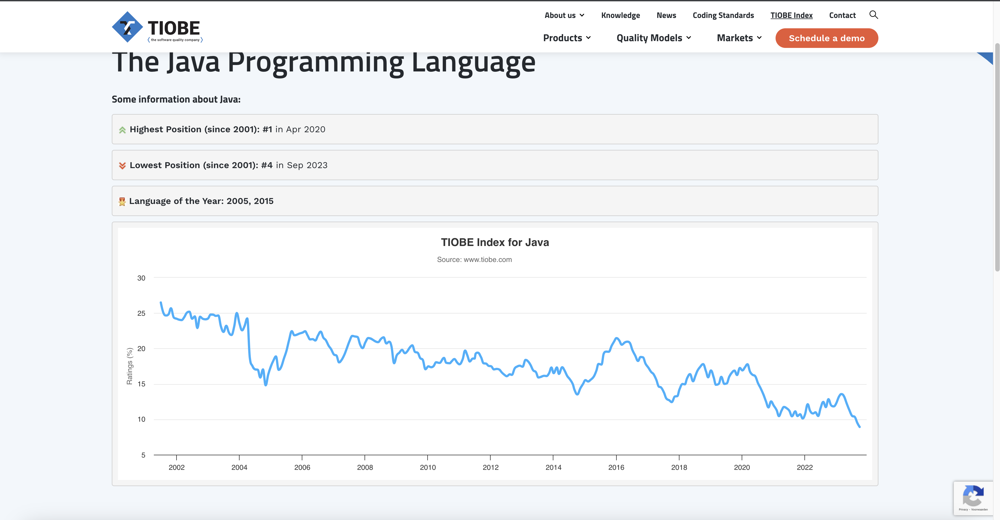
<cite style="font-size: .6em">Reference date: November 7th 2023</cite>

---

# TIOBE INDEX
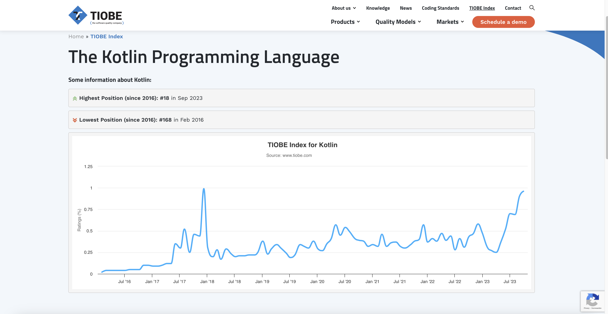
<cite style="font-size: .6em">Reference date: November 7th 2023</cite>
---
## But wait...

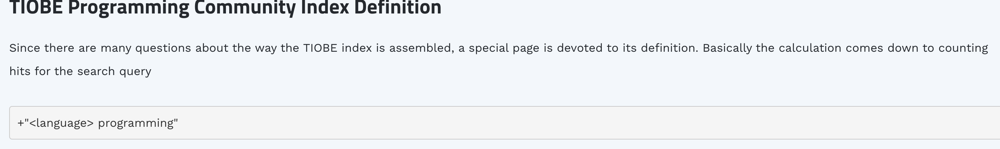

---

# Show of hands

Note:
- Who's going to try Kotlin?

---

The End.
Questions?
