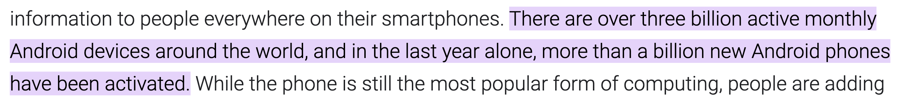

Java versus Kotlin


By: Ricky van Rijn & Thom van Kalkeren

---

Why?

Thom is convinced Kotlin is the successor of Java.
Ricky is convinced Java will prevail.

---

Who

----

Thom

32, Maarssen, Kotlin Guru / Software Architect


Note:
Actually not from the Java world, coming to the JVM ecosystem from Ruby and TypeScript, also not a Guru, that's just what Ricky calls me. 

Programming for X years. 10+ years of professional experience. Some say I quit the startup world to look after my kids,
others say that I just wanted to work with Kotlin, we'll never know...

----

Ricky

34, Veenendaal, Java Developer


---

# Enough about us..
> Show of hands

----

### Who's afraid to put their hand up?

----

### Programmed in Java?

----

### Programmed in Kotlin?

----

### Who thinks programming is fun?

----

```java
void main() {
    System.out.println("Hello World!");
}
```

Note: Staring into the void every day...
This broke the highlighter

----

```kotlin
fun main() {
    println("Hello World!")
}
```

Note: Having seen this reality, the guys from JetBrains decided to force you to have `fun`.

---

Java still runs on 3 billion devices...

[](image.png)

----

Kotlin also runs ....

----

On 3 billion devices



<cite style="font-size: .6em">blog.google/products/android/io22-multideviceworld, May 2022</cite>

----

On 3 billion devices


<cite style="font-size: .6em">(excluding iOS, desktops, and servers)</cite>

Note:
Jetbrains toolbox is also written in Kotlin.

---

Java 21 adjusted the concurrency with Project Loom 

* Virtual Threads 
* Continuation
* Concurrency

---

Kotlin has coroutines

Note: Let's play a game, spot the differences

----


Note:
Technical tidbits: Coroutines use structured concurrency, support cooperative cancellation,
and you can use loom as the dispatcher, or write your own if you love fixing race conditions.

---

Java is market leader
* Public sector
* Finance
* Industry

---

Kotlin is becoming market leader

* Android SDK is Kotlin by default
* Gradle switched to Kotlin DSL by default
* Spring Framework is getting native support for Kotlin since 3.0

---

Java is named after an island
* James Gosling drank a cup of coffee 
* The coffee inspired James with the origin of the coffee
* The Indonesian island called Java
* First name was Oak
* Oak was a name with patent so they needed another name

---

Kotlin is also named after an island

* Russian
* JetBrains

---

Java has a lot of libraries to support your solution
* Spring
* Lombok
* Many more on maven repositories such as Maven Central, Google

---

Kotlin removes NullPointerExceptions

---

Compose Multiplatform


Note: Breaking the order, go ahead Ricky, tell us about Java's answer


----


Note:
Built an actual git GUI from scratch in 2 days for OSX, Windows, and Linux.
Actually loved building it, since I had the power of Flutter without having to learn Dart.

And no, I'm not getting paid by JetBrains, but if they want to hire me 🤷🏻‍♂️... (Ricky: interject).

---

Java Sheet 5

---

Java Sheet 6

---

Kotlin sheet 7

---

Java Sheet 7

---

The End.
Questions?
