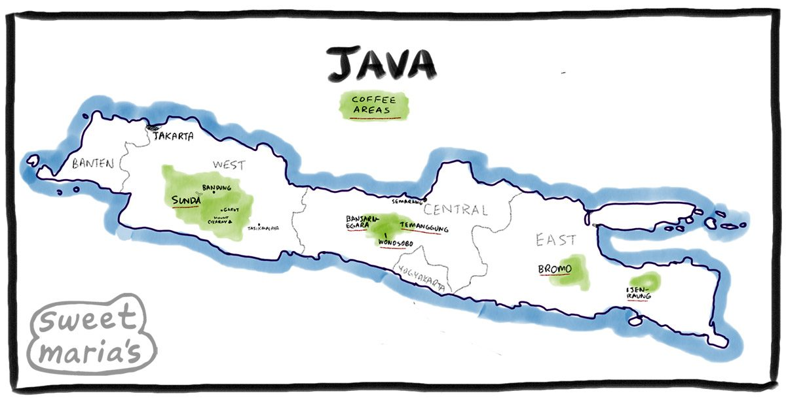

Java versus Kotlin


By: Ricky van Rijn & Thom van Kalkeren

---

Why?

Thom is convinced Kotlin is the successor of Java.
Ricky is convinced Java will prevail.

---

Who

----

Thom

32, Maarssen, Kotlin Guru / Software Architect


Note:
Actually not from the Java world, coming to the JVM ecosystem from Ruby and TypeScript, also not a Guru, that's just what Ricky calls me. 

Programming for X years. 10+ years of professional experience. Some say I quit the startup world to look after my kids,
others say that I just wanted to work with Kotlin, we'll never know...

----

Ricky

34, Veenendaal, Java Developer


---

# Enough about us..
> Show of hands

----

### Who's afraid to put their hand up?

----

### Programmed in Java?

----

### Programmed in Kotlin?

----

### Who thinks programming is fun?

----

```java
void main() {
    System.out.println("Hello World!");
}
```

Note: Staring into the void every day...
This broke the highlighter

----

```kotlin
fun main() {
    println("Hello World!")
}
```

Note: Having seen this reality, the guys from JetBrains decided to force you to have `fun`.

---

Java still runs on 3 billion devices...

[](image.png)

----

Kotlin also runs ....

----

On 3 billion devices


<cite style="font-size: .6em">blog.google/products/android/io22-multideviceworld, May 2022</cite>

----

On 3 billion devices


<cite style="font-size: .6em">(excluding iOS, desktops, and servers)</cite>

Note:
Jetbrains toolbox is also written in Kotlin.

---

# Java 21 - Project Loom 

* Virtual Threads 
* Continuation
* Concurrency paradise

Note: Old concurrency the thread was a wrapper around an OS thread. The loom variant has taken control towards inside the JVM.

----

# Traditional Threads

- OutOfMemoryError within seconds....
- OS Handles the threads directly

----
```java
class MyRunnable implements Runnable{  
    public void run(){  
        System.out.println("thread is running...");  
    }  
  
    public static void main(String args[]){
        MyRunnable myRunnable = new MyRunnable();  
        Thread myThread =new Thread(myRunnable);   // Using the constructor Thread(Runnable r)  
        myThread.start();  
     }  
}  
```
----

# Virtual Threads

- Stored in the heap instead of the stack!
- Smaller memory footprint
- Multiple virtual Threads on a carrier thread (non-blocking IO)

----
``` java
private static Thread virtualThread(String name, Runnable runnable) {
    return Thread.ofVirtual()
    .name(name)
    .start(runnable);
}
```
----

---
# Kotlin coroutines

Note: Let's play a game, spot the differences

----


Note:
Technical tidbits: Coroutines use structured concurrency, support cooperative cancellation,
and you can use loom as the dispatcher, or write your own if you love fixing race conditions.

----

One more thing..

----

Works on Java 6

```dockerfile
FROM vulhub/openjdk:6-jre

ADD build/libs/java-6-coroutines-1-all.jar /app.jar

CMD ["java", "-jar", "/app.jar"]
```


```kotlin
suspend fun carInTheStoneAge() {
    println("Hello World!")

    launch { // launch a new coroutine and continue
        delay(1000L) // non-blocking delay for 1 second (default time unit is ms)
        println("World!") // print after delay
    }
    println("Hello") // main coroutine continues while a previous one is delayed
}
```

---

Java is market leader
* Public sector
* Finance
* Industry

---

Kotlin is becoming market leader

* Android SDK is Kotlin by default
* Gradle switched to Kotlin DSL by default
* Spring Framework is getting native support for Kotlin since 3.0

---




Note: Java is named after the origin of a cup of coffee
* The coffee inspired James with the origin of the coffee
* The Indonesian island called Java
* First name was Oak
* Oak was a name with patent so they needed another name

---

Kotlin is also named after an island

* Russian
* JetBrains

---

Java has a lot of libraries/frameworks to support your solution
* Spring
* Lombok
* Many more on maven repositories such as Maven Central, Google

---

# Kotlin's compiler has your back

----

```kotlin [1-4|7|8-9|10-11]
data class User(
    val name: String,
    val address: Address?,
)

fun contrived() {
    println(user.name)
    // Compilation error
    println(user.address.street)
    // Valid
    println(user.address?.street ?: "unknown")
}
```

Note:
We have a user, but we don't know if it has an address.
Accessing the name is fine
But accessing the street throws a compilation error
Using the safe call operator we can access the street, using the elvis operator we can provide a fallback.


----

Getters/Setters

Note:
People won't get angry at you for making your public fields public.

---

Compose Multiplatform


Note: Breaking the order, go ahead Ricky, tell us about Java's answer


----


Note:
Built an actual git GUI from scratch in 2 days for OSX, Windows, and Linux.
Actually loved building it, since I had the power of Flutter without having to learn Dart.

And no, I'm not getting paid by JetBrains, but if they want to hire me 🤷🏻‍♂️... (Ricky: interject).

---

# JavaFX


---

# TIOBE INDEX


<cite style="font-size: .6em">Reference date: November 7th 2023</cite>

---

# TIOBE INDEX

<cite style="font-size: .6em">Reference date: November 7th 2023</cite>
---
## But wait...


---

# Show of hands

---

The End.
Questions?
