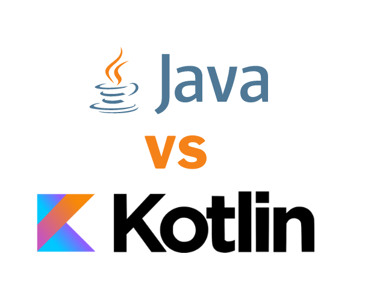
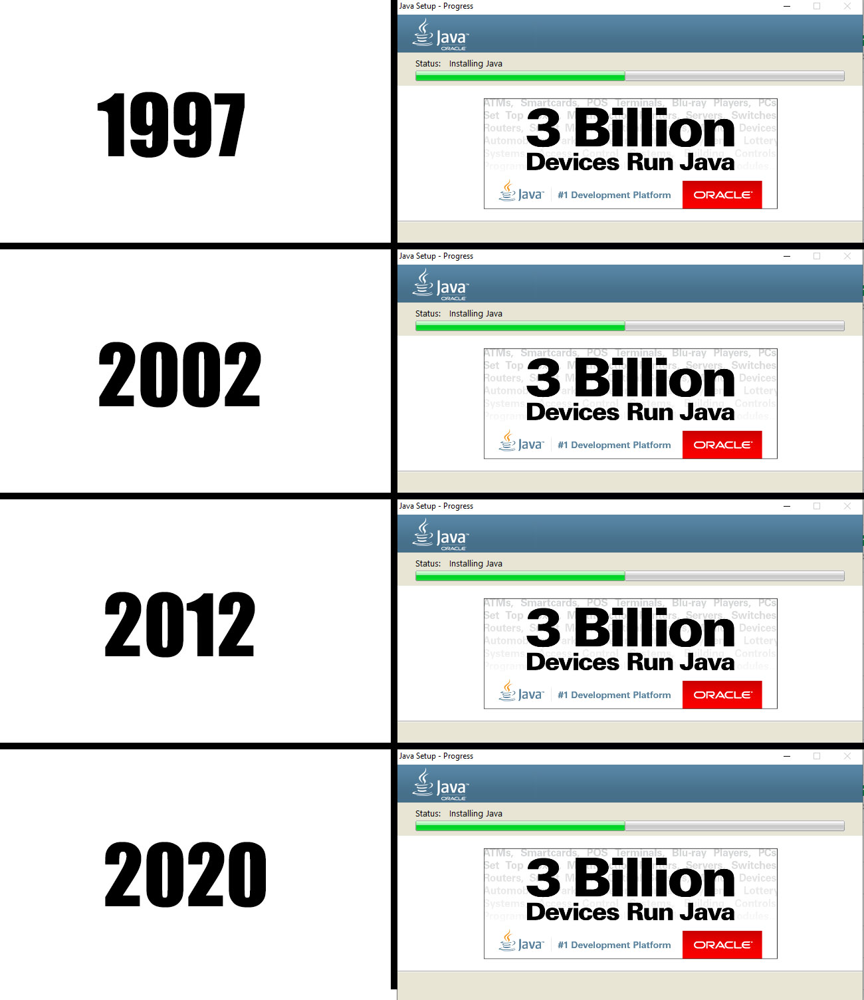

Java versus Kotlin

By: Ricky van Rijn & Thom van Kalkeren

---

Why?

Thom is convinced Kotlin is the successor of Java.
Ricky is convinced Java will prevail.

---

Who

----

Thom

32, Maarssen, Kotlin Guru / Software Architect

----

Ricky

34, Veenendaal, Java Developer

---

Java still runs on 3 billion devices...

---

Kotlin also runs ....

---

Java 21 adjusted the concurrency with Project Loom 

* Virtual Threads 
* Continuation
* Concurrency

---

Kotlin has coroutines

* Coroutines

---

Java is market leader
* Public sector
* Finance
* Industry

---

Kotlin is becoming market leader

* Android SDK is kotlin by default
* Spring Framework is getting native support for Kotlin since 3.0

---

Java is named after an island
* James Gosling drank a cup of coffee 
* The coffee inspired James with the origin of the coffee
* The Indonesian island called Java
* First name was Oak
* Oak was a name with patent so they needed another name

---

Kotlin is also named after an island

* Russian
* JetBrains

---

Java has a lot of libraries to support your solution
* Spring
* Lombok
* Many more on maven repositories such as Maven Central, Google

---

Kotlin removes NullPointerExceptions

---

Java Sheet 5

---

Kotlin sheet 6

---

Java Sheet 6

---

Kotlin sheet 7

---

Java Sheet 7

---

The End.
Questions?